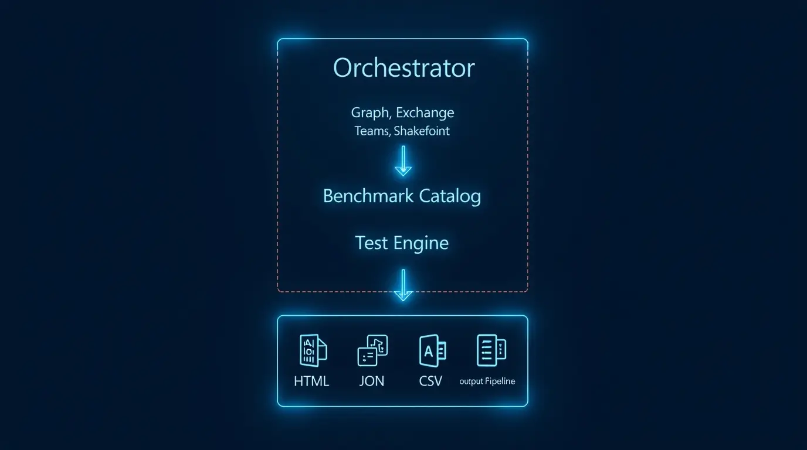
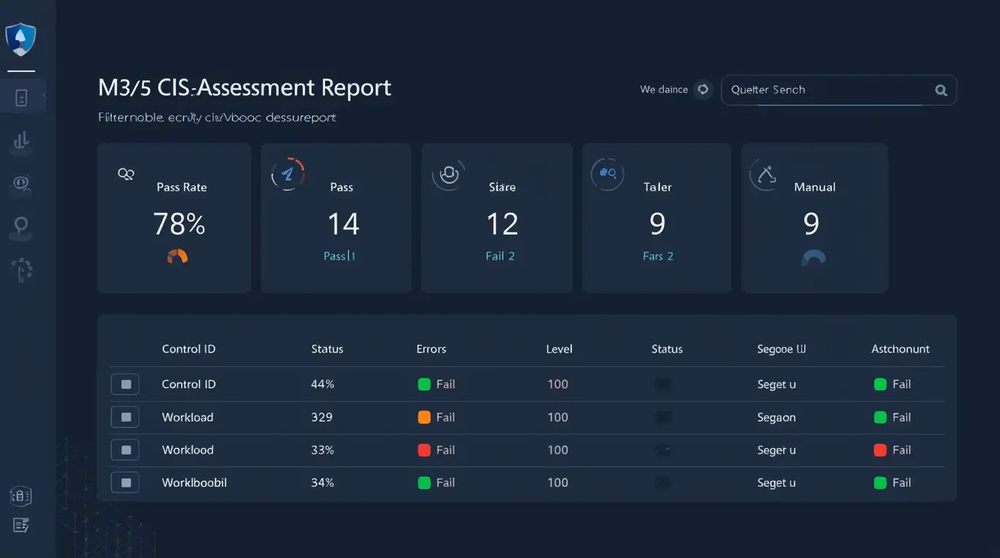
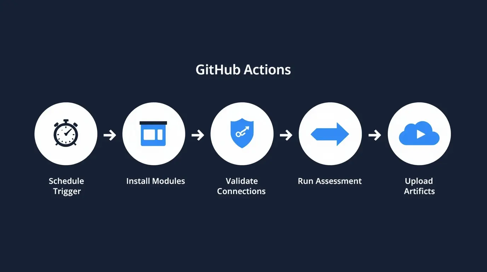

# M365 CIS Assessor 🛡️

[](https://github.com/suresh-1001/m365-cis-assessor/actions/workflows/ci.yml)
[](LICENSE)


> Automated Microsoft 365 security assessment tool aligned to the **CIS Microsoft 365 Foundations Benchmark v6.0.1**.


Built by [Linesight Digital](https://linesightdigital.com) — Microsoft 365 security consulting and automation for SMB and mid-market.

---

## What It Does

- Connects to your M365 tenant using **certificate-based app-only authentication** — no interactive login, no stored passwords
- Evaluates tenant configuration against **CIS Microsoft 365 Foundations Benchmark v6.0.1** controls
- Covers **Entra ID, Exchange Online, Teams, and SharePoint/OneDrive**
- Produces an **HTML dashboard**, **JSON evidence package**, and **CSV control register** per scan run
- Supports scheduled runs via **GitHub Actions** or **Azure Automation**

---

## Architecture



```
Runner / Orchestrator
    └── Auth / Connection Broker (cert-based app-only)
            └── Provider Layer (Graph · Exchange · Teams · SharePoint)
                    └── Control Catalog (JSON benchmark packs)
                            └── Test Engine (assertion + evidence collection)
                                    └── Output Pipeline → HTML · JSON · CSV
```

Full detail: [docs/architecture.md](docs/architecture.md)

---

## Control Coverage

| Workload | Controls | Automated | Manual Review |
|---|---|---|---|
| Entra ID / Graph | 25 | 22 | 3 |
| Exchange Online | 18 | 16 | 2 |
| Teams | 12 | 10 | 2 |
| SharePoint / OneDrive | 10 | 8 | 2 |
| **Total** | **65** | **56** | **9** |

Full list: [docs/benchmark-support-matrix.md](docs/benchmark-support-matrix.md)

---

## Quick Start

### Prerequisites

- PowerShell 7.2+
- An Entra app registration with certificate authentication ([setup guide](docs/deployment-runbook.md))
- Required modules:

```powershell
.\build\install-modules.ps1
```

### Run an Assessment

```powershell
Import-Module .\src\Assessor\Assessor.psm1

Invoke-M365Assessment `
    -TenantConfigPath .\config\tenants\sample-tenant.json `
    -Benchmark cis-m365-foundations-6.0.1 `
    -OutputPath .\output `
    -Workloads Graph,Exchange,Teams,SharePoint
```

### Validate Connections First

```powershell
Test-M365Connections `
    -TenantConfigPath .\config\tenants\sample-tenant.json `
    -Verbose
```

---

## Tenant Configuration

Copy `config/tenants/sample-tenant.json` and fill in your app registration details:

```json
{
  "TenantName": "Contoso Production",
  "TenantId": "aaaaaaaa-bbbb-cccc-dddd-eeeeeeeeeeee",
  "DefaultDomain": "contoso.onmicrosoft.com",
  "Graph": {
    "ClientId": "11111111-2222-3333-4444-555555555555",
    "CertificateThumbprint": "ABCDEF1234567890ABCDEF1234567890ABCDEF12"
  },
  "Exchange": {
    "AppId": "11111111-2222-3333-4444-555555555555",
    "CertificateThumbprint": "ABCDEF1234567890ABCDEF1234567890ABCDEF12",
    "Organization": "contoso.onmicrosoft.com"
  },
  "Teams": {
    "ApplicationId": "11111111-2222-3333-4444-555555555555",
    "CertificateThumbprint": "ABCDEF1234567890ABCDEF1234567890ABCDEF12",
    "TenantId": "aaaaaaaa-bbbb-cccc-dddd-eeeeeeeeeeee"
  },
  "SharePoint": {
    "AdminUrl": "https://contoso-admin.sharepoint.com",
    "ClientId": "11111111-2222-3333-4444-555555555555",
    "TenantId": "aaaaaaaa-bbbb-cccc-dddd-eeeeeeeeeeee",
    "CertificateThumbprint": "ABCDEF1234567890ABCDEF1234567890ABCDEF12"
  }
}
```

> `config/tenants/*.json` is git-ignored except for `sample-tenant.json`.

---

## Output Structure

Each run produces a timestamped folder:

```
output/runs/2026-04-13T10-00-00Z_contoso-prod/
├── manifest.json
├── summary.json
├── control-results.csv
├── dashboard.html
├── exceptions.csv
├── evidence/
│   ├── CIS.M365.1.1.1.json
│   └── ...
├── raw/
└── logs/
    └── run.log
```



---

## Required Permissions

| Workload | Permission |
|---|---|
| Graph / Entra | `Policy.Read.All`, `Directory.Read.All`, `AuditLog.Read.All`, `IdentityRiskyUser.Read.All`, `SecurityEvents.Read.All` |
| Exchange Online | `Exchange.ManageAsApp` + `Exchange Administrator` role |
| Teams | `TeamworkAppSettings.Read.All`, `Team.ReadBasic.All` |
| SharePoint | `Sites.FullControl.All` |

Full matrix: [docs/permissions-matrix.md](docs/permissions-matrix.md)

---

## CI/CD — Scheduled Scanning



```yaml
# Runs every Monday at 6 AM UTC
on:
  schedule:
    - cron: '0 6 * * 1'
```

See [.github/workflows/scheduled-assessment.yml](.github/workflows/scheduled-assessment.yml)

---

## Roadmap

- [x] Repo scaffold and auth layer
- [x] Test engine and result schema
- [x] Entra ID / Graph provider + controls
- [x] Exchange Online provider + controls
- [ ] Teams provider + controls
- [ ] SharePoint / PnP provider + controls
- [ ] HTML dashboard v2 (trend view)
- [ ] Pester unit tests
- [ ] Multi-tenant packaging

---

## License

MIT — use freely, attribution appreciated.

---

## About

Built and maintained by **Suresh Chand** at [Linesight Digital](https://linesightdigital.com).
M365 security consulting, Intune/Entra implementation, and compliance automation.

📍 San Jose, CA &nbsp;|&nbsp; 📧 suresh@echand.com &nbsp;|&nbsp; 💼 [LinkedIn](https://linkedin.com/in/sureshchand01)
