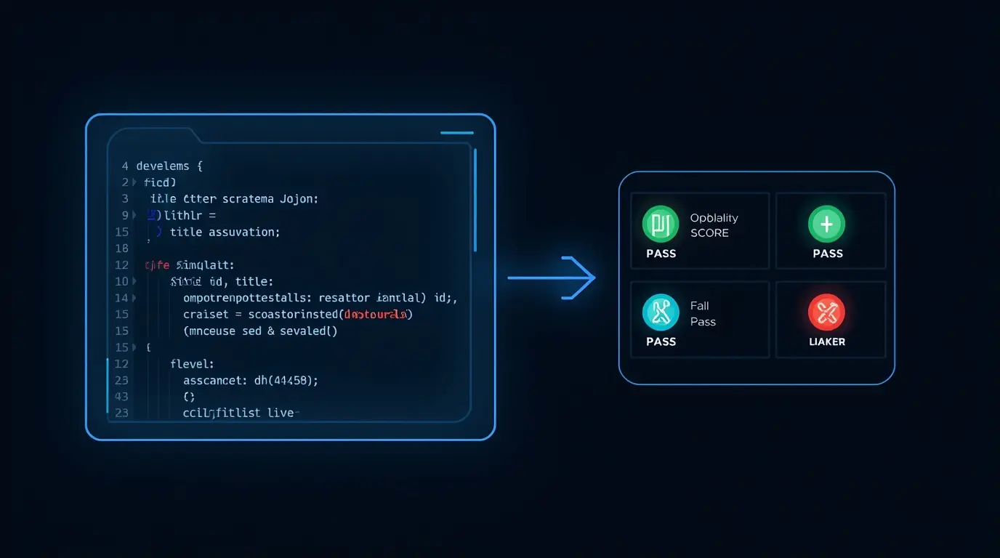

# Architecture

## Overview

The M365 CIS Assessor is a PowerShell-based assessment engine that connects to Microsoft 365 workloads using certificate-based app-only authentication, runs controls from a JSON-defined benchmark catalog, and produces a structured output package (HTML, JSON, CSV).


---

## Component Map

```
Runner / Orchestrator  (Invoke-M365Assessment)
    │
    ├── Tenant Config  (config/tenants/*.json)
    │
    ├── Auth Broker
    │   ├── Connect-GraphApp       → Microsoft Graph (app-only)
    │   ├── Connect-ExchangeApp    → Exchange Online (app-only)
    │   ├── Connect-TeamsApp       → Microsoft Teams (app-only)
    │   └── Connect-SharePointApp  → SharePoint/PnP (app-only)
    │
    ├── Benchmark Loader  (Resolve-BenchmarkPack)
    │   └── catalog/benchmarks/cis-m365-foundations-6.0.1/
    │       ├── controls/entra/
    │       ├── controls/exchange/
    │       ├── controls/teams/
    │       └── controls/sharepoint/
    │
    ├── Test Engine  (Invoke-ControlTest)
    │   ├── Executes assertion scriptblock per control
    │   ├── Returns standardised result object
    │   └── Writes per-control evidence JSON
    │
    └── Output Pipeline
        ├── dashboard.html    (New-AssessmentDashboard)
        ├── summary.json
        ├── control-results.csv
        ├── evidence/*.json
        └── manifest.json
```

---

## Auth Model

All workload connections use **certificate-based app-only authentication** — no delegated permissions, no interactive login, no stored passwords.

| Workload | Module | Auth Method |
|---|---|---|
| Graph / Entra | Microsoft.Graph | `Connect-MgGraph -CertificateThumbprint` |
| Exchange Online | ExchangeOnlineManagement | `Connect-ExchangeOnline -CertificateThumbprint` |
| Teams | MicrosoftTeams | `Connect-MicrosoftTeams -CertificateThumbprint` |
| SharePoint | PnP.PowerShell | `Connect-PnPOnline -CertificateThumbprint` |

The certificate is installed in the local machine/user certificate store. The thumbprint is stored in the tenant config JSON (never the private key).

---

## Control Catalog Schema

Each control is a JSON object with this structure:



```json
{
  "id": "CIS.M365.1.1.1",
  "title": "Human-readable title",
  "section": "CIS section heading",
  "level": 1,
  "assessmentStatus": "Automated",
  "description": "Why this control matters.",
  "remediationUrl": "https://learn.microsoft.com/...",
  "assertion": "param($Connections)\n..."
}
```

The `assertion` field is a PowerShell scriptblock (as a string) that must return:

```powershell
@{
    Pass     = $true | $false
    Detail   = 'Human-readable explanation of the result'
    Evidence = $anyObject   # serialised to per-control JSON evidence file
}
```

---

## Result Object Schema

Every control produces a standardised result object:

| Field | Type | Description |
|---|---|---|
| ControlId | string | CIS control ID e.g. `CIS.M365.1.1.1` |
| Title | string | Control title |
| Section | string | CIS benchmark section |
| Workload | string | Graph / Exchange / Teams / SharePoint |
| Level | int | CIS level 1 or 2 |
| AssessmentStatus | string | Automated / Manual |
| Status | string | Pass / Fail / Error / Manual / NotApplicable |
| StatusReason | string | Human-readable explanation |
| Evidence | object | Raw data collected during assessment |
| RemediationUrl | string | Microsoft docs link |
| StartTime | datetime | UTC |
| EndTime | datetime | UTC |
| DurationMs | int | Milliseconds |

---

## Output Structure

```
output/runs/{timestamp}_{tenant-slug}/
├── manifest.json          # Run metadata
├── summary.json           # Aggregate pass/fail counts
├── control-results.csv    # All results, filterable
├── dashboard.html         # Interactive HTML report
├── exceptions.csv         # Manual / NotApplicable register
├── evidence/              # Per-control raw evidence
│   ├── CIS.M365.1.1.1.json
│   └── ...
├── raw/                   # Raw provider data (future use)
└── logs/
    └── run.log
```

---

## CI/CD


The GitHub Actions scheduled workflow:

1. Installs modules
2. Writes tenant config from repository secrets
3. Installs the PFX certificate from a base64-encoded secret
4. Validates connections (`Test-M365Connections`)
5. Runs the full assessment (`Invoke-M365Assessment`)
6. Uploads the output folder as a workflow artifact (retained 90 days)
7. Cleans up the tenant config file

See [.github/workflows/scheduled-assessment.yml](../.github/workflows/scheduled-assessment.yml)
