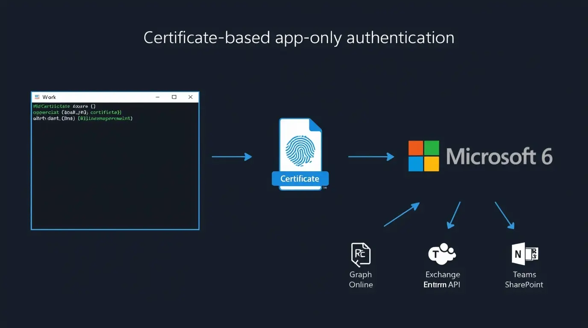

# Deployment Runbook

Step-by-step guide to register the Entra app, create the certificate, assign permissions, and run your first assessment.

---

## Step 1 — Register the Entra App

1. Go to [https://entra.microsoft.com](https://entra.microsoft.com)
2. Navigate to **Identity → Applications → App registrations → New registration**
3. Name: `M365-CIS-Assessor`
4. Supported account types: **Accounts in this organizational directory only**
5. No redirect URI needed
6. Click **Register**

Note the **Application (client) ID** and **Directory (tenant) ID** — you'll need both.

---

## Step 2 — Create a Self-Signed Certificate

Run this on the machine where assessments will execute (or on your GitHub Actions runner via secrets):

```powershell
$cert = New-SelfSignedCertificate `
    -Subject "CN=M365-CIS-Assessor" `
    -CertStoreLocation "Cert:\CurrentUser\My" `
    -KeyExportPolicy Exportable `
    -KeySpec Signature `
    -KeyLength 2048 `
    -HashAlgorithm SHA256 `
    -NotAfter (Get-Date).AddYears(2)

# Note the thumbprint
Write-Host "Thumbprint: $($cert.Thumbprint)"

# Export public key for upload to Entra
Export-Certificate `
    -Cert $cert `
    -FilePath "$env:TEMP\M365-CIS-Assessor.cer"

# Export PFX for GitHub Actions secret (optional)
$pwd = ConvertTo-SecureString -String 'YourSecurePassword' -AsPlainText -Force
Export-PfxCertificate `
    -Cert $cert `
    -FilePath "$env:TEMP\M365-CIS-Assessor.pfx" `
    -Password $pwd
```

---

## Step 3 — Upload Certificate to Entra App



1. In your app registration, go to **Certificates & secrets → Certificates**
2. Click **Upload certificate**
3. Upload the `.cer` file exported above
4. Confirm the thumbprint matches

---

## Step 4 — Assign API Permissions

In the app registration, go to **API permissions → Add a permission**:

### Microsoft Graph (Application permissions)

| Permission | Purpose |
|---|---|
| `Policy.Read.All` | Read CA policies, auth policies |
| `Directory.Read.All` | Read users, groups, roles, devices |
| `AuditLog.Read.All` | Read audit and sign-in logs |
| `IdentityRiskyUser.Read.All` | Read risky user data |
| `SecurityEvents.Read.All` | Read Defender security events |
| `Organization.Read.All` | Read tenant/org settings |
| `RoleManagement.Read.All` | Read directory role assignments |
| `TeamworkAppSettings.Read.All` | Read Teams settings |
| `Team.ReadBasic.All` | Read Teams configuration |
| `Sites.FullControl.All` | Read SharePoint tenant settings |

After adding, click **Grant admin consent**.

### Exchange Online

Exchange requires a separate app role assignment — Graph API permissions do not cover Exchange cmdlets.

```powershell
# Run as Global Admin
New-ServicePrincipal `
    -AppId '<your-app-client-id>' `
    -ServiceId '<your-app-object-id>' `
    -DisplayName 'M365-CIS-Assessor'

Add-RoleGroupMember -Identity 'View-Only Organization Management' `
    -Member 'M365-CIS-Assessor'
```

---

## Step 5 — Configure Tenant JSON

Copy `config/tenants/sample-tenant.json` to `config/tenants/your-tenant.json` and populate:

```json
{
  "TenantName": "Your Company",
  "TenantId": "<directory-tenant-id>",
  "DefaultDomain": "yourcompany.onmicrosoft.com",
  "Graph": {
    "ClientId": "<app-client-id>",
    "CertificateThumbprint": "<cert-thumbprint>"
  },
  "Exchange": {
    "AppId": "<app-client-id>",
    "CertificateThumbprint": "<cert-thumbprint>",
    "Organization": "yourcompany.onmicrosoft.com"
  },
  "Teams": {
    "ApplicationId": "<app-client-id>",
    "CertificateThumbprint": "<cert-thumbprint>",
    "TenantId": "<directory-tenant-id>"
  },
  "SharePoint": {
    "AdminUrl": "https://yourcompany-admin.sharepoint.com",
    "ClientId": "<app-client-id>",
    "TenantId": "<directory-tenant-id>",
    "CertificateThumbprint": "<cert-thumbprint>"
  }
}
```

> This file is git-ignored. Never commit real tenant configs.

---

## Step 6 — Install Modules and Validate

```powershell
# Install required modules
.\build\install-modules.ps1

# Import the module
Import-Module .\src\Assessor\Assessor.psm1

# Validate all workload connections
Test-M365Connections -TenantConfigPath .\config\tenants\your-tenant.json -Verbose
```

All four workloads should return `OK`.

---

## Step 7 — Run Your First Assessment

```powershell
Invoke-M365Assessment `
    -TenantConfigPath .\config\tenants\your-tenant.json `
    -Benchmark cis-m365-foundations-6.0.1 `
    -OutputPath .\output `
    -Workloads Graph,Exchange,Teams,SharePoint
```

Open `output/runs/{run-id}/dashboard.html` in a browser to view results.

---

## GitHub Actions Setup

To enable scheduled scanning via GitHub Actions:

1. Go to your repo → **Settings → Secrets and variables → Actions**
2. Add the following secrets:

| Secret | Value |
|---|---|
| `TENANT_NAME` | Display name e.g. `Contoso` |
| `TENANT_ID` | Directory tenant ID (GUID) |
| `DEFAULT_DOMAIN` | e.g. `contoso.onmicrosoft.com` |
| `GRAPH_CLIENT_ID` | App registration client ID |
| `CERT_THUMBPRINT` | Certificate thumbprint |
| `CERT_PFX_BASE64` | Base64-encoded PFX file |
| `CERT_PASSWORD` | PFX password |
| `SHAREPOINT_PREFIX` | e.g. `contoso` (for admin URL) |

To get the base64 PFX:

```powershell
[Convert]::ToBase64String([IO.File]::ReadAllBytes('C:\Temp\M365-CIS-Assessor.pfx'))
```

Paste the output as the `CERT_PFX_BASE64` secret value.
